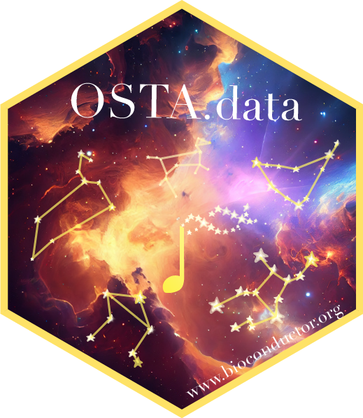

# Introduction



`OSTA.data` is a data retrieval package for all data used in the OSTA book. It conveniently loads raw data from Open Science Framework (OSF) to cache or local download.

# Installation

``` r
if (!require("BiocManager", quietly=TRUE))
    install.packages("BiocManager")
BiocManager::install("OSTA.data")
```

# Usage

The following data are available to download in `library(OSTA.data)`

``` r
OSTA.data_list()
#  [1] "Chromium_HumanBreast_Janesick"
#  [2] "Chromium_HumanColon_Oliveira" 
#  [3] "CosMx1k_MouseBrain1"          
#  [4] "CosMx1k_MouseBrain2"          
#  [5] "CosMx6k_HumanBrain"           
#  [6] "Visium_HumanBreast_Janesick"  
#  [7] "Visium_HumanColon_Oliveira"   
#  [8] "VisiumHD_HumanColon_Oliveira" 
#  [9] "Xenium_HumanBreast1_Janesick" 
# [10] "Xenium_HumanColon_Oliveira"
```

Each data set can be retrieved and unzipped. List necessary raw data files available with `list.files(td)`.

``` r
pa <- OSTA.data_load("Xenium_HumanColon_Oliveira")
# unpacking
dir.create(td <- tempfile())
unzip(pa, exdir=td)
```

After download, import data as a `SpatialExperiment` object with [`library(SpatialExperimentIO)`](https://github.com/estellad/SpatialExperimentIO).

``` r
library(SpatialExperimentIO)
(spe <- readXeniumSXE(td))
# class: SpatialExperiment 
# dim: 541 340837 
# metadata(3): transcripts cell_boundaries nucleus_boundaries
# assays(1): counts
# rownames(541): ABCC8 ACP5 ... UnassignedCodeword_0330 UnassignedCodeword_0338
# rowData names(3): ID Symbol Type
# colnames(340837): aaaadaba-1 aaaadgga-1 ... oikdmkkf-1 oikeebja-1
# colData names(10): cell_id transcript_counts ... nucleus_area sample_id
# reducedDimNames(0):
# mainExpName: NULL
# altExpNames(0):
# spatialCoords names(2) : x_centroid y_centroid
# imgData names(0):
```

## Citation

------------------------------------------------------------------------

HL Crowell\*°, Y Dong\*, I Billato, P Cai, M Emons, S Gunz, B Guo, M Li, A Mahmoud, A Manukyan, H Pagès, P Panwar, S Rao, CJ Sargeant, L Shepherd Kern, M Ramos, J Sun, M Totty, VJ Carey, Y Chen, L Collado-Torres, S Ghazanfar, KD Hansen, K Martinowich, KR Maynard, E Patrick, D Righelli, D Risso, S Tiberi, L Waldron, R Gottardo†°, MD Robinson†°, SC Hicks†°, LM Weber†°. Orchestrating spatial transcriptomics analysis with Bioconductor. *bioRxiv* (2025). [doi:10.1101/2025.11.20.688607](http://doi.org/10.1101/2025.11.20.688607)

(\* co-first. † co-senior. ° correspondence.)

------------------------------------------------------------------------
